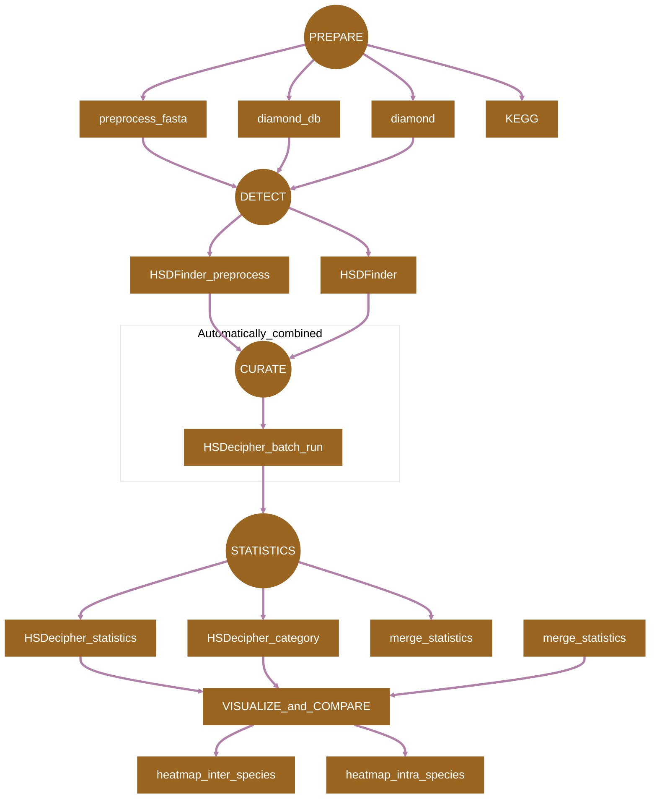

[](https://snakemake.readthedocs.io)
[](https://docs.conda.io/en/latest/)

## Introduction

**HSDSnake** is a [SnakeMake](https://snakemake.readthedocs.io) pipeline for comprehensive analysis of highly similar duplicates (HSDs) in genomes. The tools are shown in the [Pipeline Flowchart](#pipeline-flowchart) and their references are listed in [Citations.md](/docs/Citations.md).

## Pipeline Flowchart



## Usage

Refer to [Usage](./docs/Usage.md) documents for details.

> [!NOTE]
> If you are new to Snakmake, please refer to [this page](https://snakemake.readthedocs.io/en/stable/getting_started/installation.html) on how to set-up SnakeMake. Make sure to test the sample data below before running the workflow on actual data.

```
# Test if you have successfully installed the SnakeMake
mamba activate snakemake
snakemake --help
```


Prepare an `config.yaml` file with following columns representing input files for HSDSnake, please only substitute the species name to yours, keep the input file format, such as Arabidopsis_thaliana.fa, Arabidopsis_thaliana.interproscan.tsv, Arabidopsis_thaliana.ko.txt.

```
samples:
  - Arabidopsis_thaliana
  - Chlamydomonas_reinhardtii
 
genomes:
  Arabidopsis_thaliana:
    proteins: "data/Arabidopsis_thaliana.fa"
    interproscan: "data/Arabidopsis_thaliana.interproscan.tsv"
    KEGG: "data/Arabidopsis_thaliana.ko.txt"

  Chlamydomonas_reinhardtii:
    proteins: "data/Chlamydomonas_reinhardtii.fa"
    interproscan: "data/Chlamydomonas_reinhardtii.interproscan.tsv"
    KEGG: "data/Chlamydomonas_reinhardtii.ko.txt"
```

Now, you can run the pipeline using the following commands:

```
# Download the package
git clone https://github.com/zx0223winner/HSDSnake.git

# enter the working directory
cd HSDSnake
```
> [!NOTE]
>Due to the size of sample files, please download the test data - `HSDSnake_data.tar.gz` through the Google drive [link](https://drive.google.com/file/d/15jGPsKRUn_SzXmaIAdXEQcxrychX-d9a/view?usp=sharing)

```
# Then decompress the file HSDSnake_data.tar.gz under the HSDSnake directory,
# This will bring you a data folder with test files ready 
tar -xvzf HSDSnake_data.tar.gz

# Then you can give a dry run by the following command.
snakemake --use-conda --cores all -n

# If everthing is OK, then you can test the pipeline by running:
snakemake --use-conda --cores all
```


##  Citations
HSDecipher protocol, HSDatabase, HSDFinder tool, HSD review, HSD examples:
1. Xi Zhang, Yining Hu, Zhenyu Cheng, John M. Archibald (2023). HSDecipher: A pipeline for comparative genomic analysis of highly similar duplicate genes in eukaryotic genomes. StarProtocols. doi:  doi: https://doi.org/10.1016/j.xpro.2022.102014 
2. Zhang, X., Hu, Y. & Smith, D. R. 2022. HSDatabase - a database of highly similar duplicate genes from plants, animals, and algae. Database, doi:http://doi.org/10.1093/database/baac086.
3. Zhang, X. & Smith, D. R. 2022. An overview of online resources for intra-species detection of gene duplications. Frontiers in Genetics, doi: http://doi.org/10.3389/fgene.2022.1012788.
4. Xi Zhang, Yining Hu, David Roy Smith. (2021). HSDFinder: a BLAST-based strategy to search for highly similar duplicated genes in eukaryotic genomes. Frontiers in Bioinformatics. doi: http://doi.org/10.3389/fbinf.2021.803176
5. Xi Zhang, Yining Hu, David Roy Smith. (2021). Protocol for HSDFinder: Identifying, annotating, categorizing, and visualizing duplicated genes in eukaryotic genomes DOI: https://doi.org/10.1016/j.xpro.2021.100619
6. Xi Zhang, et.al. David Roy Smith (2021). Draft genome sequence of the Antarctic green alga Chlamydomonas sp. UWO241 DOI:https://doi.org/10.1016/j.isci.2021.102084


## Links to the InterProScan and KEGG
 
 1. Pfam 37.0 (Sep 2024, 21,979 entries): https://pfam.xfam.org
 2. InterPro 101.0 (Jul 2024, 45,899 entries):http://www.ebi.ac.uk/interpro/
 3. KEGG Orthology Database: https://www.genome.jp/kegg/ko.html
 4. InterProscan: https://github.com/ebi-pf-team/interproscan
 5. KEGG : https://www.kegg.jp/kegg/
 6. Diamond: https://github.com/bbuchfink/diamond

